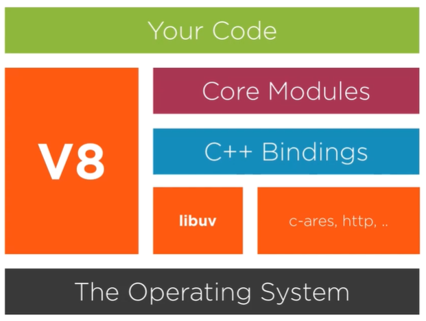

# node-cpp-integration

## Node architecture
What is Node.js?
- A wrapper around JavaScript Engine (V8) with built-in modules providing rich features through easy-to-use async APIs

Architecture


- V8: Google's open source JavaScript engine, written in C++ (https://github.com/v8/v8)
- libuv: a multi-platform support library with a focus on asynchronous I/O, written in C (https://github.com/libuv/libuv)

___
## C++ addons
What is C++ addons?
- Addons are dynamically-linked shared objects written in C++. 
- The `require()` function can load addons (`.node`) as ordinary Node.js modules. 
- Addons provide an interface between JavaScript and C/C++ libraries.
- a.k.a native addon, native module

Options for implementing addons:
- direct use of V8, libuv, Node.js libraries
- Native Abstractions for Node.js (NAN)
- Node-API

> Unless there is a need for direct access to functionality which is not exposed by Node-API, use Node-API.

___
### Build tool: node-gyp
https://github.com/nodejs/node-gyp

What is node-gyp?
- a cross-platform command-line tool for compiling native addon modules for Node.js, written in python

Installation
``` bash
npm install -g node-gyp
```

The `binding.gyp` file

- a binding.gyp file describes the configuration to build your module, in a JSON-like format. This file gets placed in the root of your package, alongside package.json.

Commands
| **Command**   | **Description**
|:--------------|:---------------------------------------------------------------
| `build`       | Invokes `make`/`msbuild.exe` and builds the native addon
| `clean`       | Removes the `build` directory if it exists
| `configure`   | Generates project build files for the current platform
| `rebuild`     | Runs `clean`, `configure` and `build` all in a row

Options
- Node version
- Platform (ex. win32)
- CPU Architecture (ex. x64)

___
### Direct use of V8
Cons:
- update wrapper cpp and compile for changes in V8

___
### Native Abstractions for Node.js (NAN)
https://github.com/nodejs/nan

C++-based abstraction between Node and direct V8 APIs

> Nightmare: thanks to the crazy changes in V8 (and some in Node core), keeping native addons compiling happily across versions

Cons:
- not all V8 APIs are available (not official)
___
### Node-API
https://nodejs.org/api/n-api.html

What is Node-API (N-API)?

- Node-API is an API for building native addons. 
- It is independent from the underlying JavaScript runtime (e.g. V8) and is maintained as part of `Node.js` itself.  (official, from Node v8)
- This API will be `Application Binary Interface (ABI)` stable across versions of Node.js. 

It is intended to insulate addons from changes in the underlying JavaScript engine and allow modules compiled for one version to run on later versions of Node.js without recompilation.

Two implementations:
- Node-API: C-based API guaranteeing ABI stability across different node versions as well as JavaScript engines.
- node-addon-api: header-only C++ wrapper classes which simplify the use of the C-based Node-API.

___
## Foreign Function Interface (FFI)
What is FFI?
- a Node.js addon for loading and calling dynamic libraries using pure JavaScript.
- can be used to create bindings to native libraries without writing any C++ code.

Two implementations:
- node-ffi: https://github.com/node-ffi/node-ffi (deprecated? only support until Node v10)
``` bash
npm install ffi
```
- node-ffi-napi: https://github.com/node-ffi-napi/node-ffi-napi
``` bash
npm install ffi-napi
```
___
## Other
Type translation

With Electron:
- electron build vs node-gyp build
- has a different Application Binary Interface (ABI) from a given Node.js binary

___
## Reference
- https://nodejs.org/api/addons.html
- https://nodejs.org/api/n-api.html
- https://github.com/nodejs/node-addon-examples
- https://koistya.medium.com/how-to-call-c-c-code-from-node-js-86a773033892
- https://juejin.cn/post/6844903971220357134
- https://github.com/node-ffi-napi


